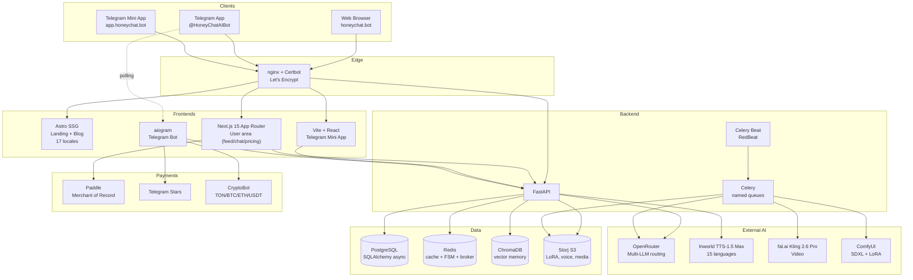
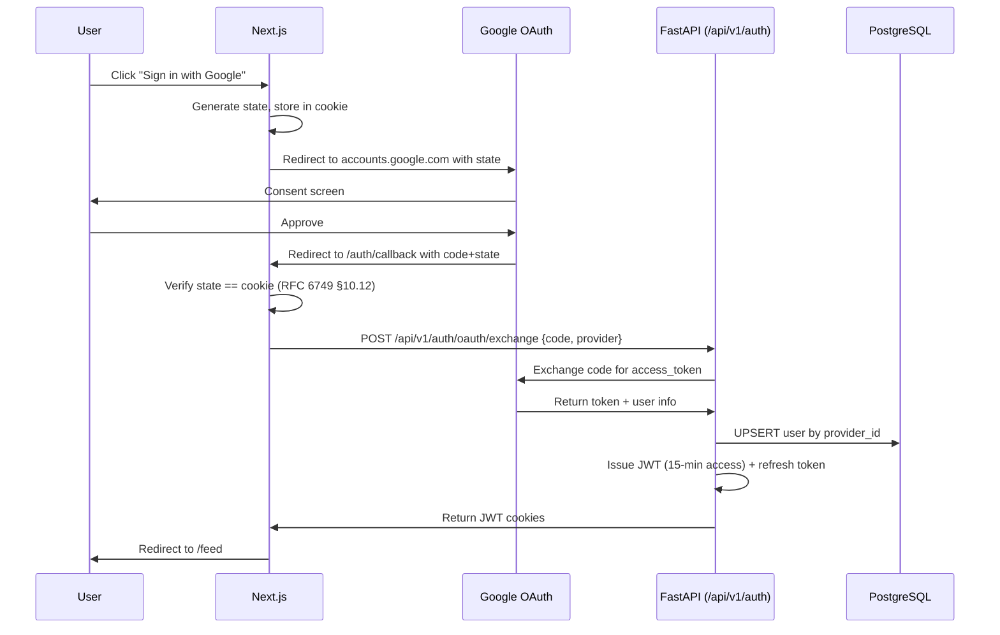
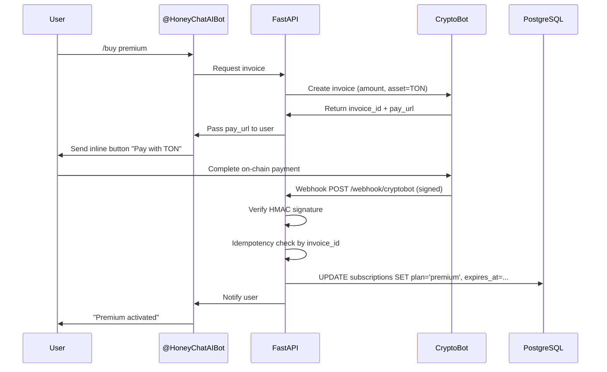

# HoneyChat Architecture

High-level architecture of the HoneyChat AI companion platform. This document describes the public-facing technical design — the full application source is proprietary.

## Service Topology

## Key Flows

### 1. Chat Message (Telegram bot)

1. User sends message via `@HoneyChatAIBot`
2. aiogram dispatcher picks up update
3. Middleware chain: **Auth → Onboarding → Rate Limit → Plan Inject → Cost Guard**
4. Handler increments Redis daily counter (atomic `INCR`)
5. Memory retrieval: Redis recent (last 20) + ChromaDB semantic (top-K by embedding similarity)
6. System prompt constructed with character persona + memory + tier limits
7. LLM call via OpenRouter (model selected by plan tier)
8. Content escalation check — if intent over tier, spawn in-character refusal + upsell
9. Response stored in Redis + ChromaDB (for future semantic retrieval)
10. Message sent back via Telegram API

### 2. Web Login (Multi-provider)

Seven OAuth providers + email + guest. Example Google flow:

### 3. Crypto Payment (Telegram)

## Memory System (3-layer)

| Layer | Storage | TTL | Purpose |
|-------|---------|-----|---------|
| Recent | Redis sorted set `mem:recent:{user}:{char}` | 7 days | Last 20 messages, fast retrieval for every turn |
| Semantic | ChromaDB collection `mem:{user}:{char}` | Unbounded | Embeddings of key events/emotions, top-K similarity search |
| Summary | PostgreSQL `memory_summaries` | Persistent | Auto-generated rolling summary when recent + semantic exceeds tier token budget |

Summarization is triggered asynchronously via Celery `summarize` queue when token count exceeds plan's `PLAN_CONTEXT_TOKENS` threshold.

## LLM Routing by Tier

| Tier | Default model | Output tokens | Monthly price |
|------|--------------|---------------|---------------|
| Free | Qwen3-235B MoE (free tier) | 250 | $0 |
| Basic | Qwen3-235B MoE | 400 | $4.99 |
| Premium | Qwen3-235B MoE (more context) | 600 | $9.99 |
| VIP | Gemini 3.1 Flash Lite | 800 | $19.99 |
| Elite | Aion-2.0 (RP fine-tuned) | 800 | $39.99 |

Instant-mode users also have access to Grok 4.1 Fast for explicit-content turns (via `model_switcher.py` override).

## Infra Layout (Docker Compose)

| Service | Purpose |
|---------|---------|
| `bot` | Telegram aiogram bot (polling) |
| `api` | FastAPI (4 uvicorn workers) |
| `nextjs` | Next.js 15 standalone server |
| `celery_worker` | Async job processing (7 queues) |
| `celery_beat` | Periodic scheduler |
| `gen_worker` | Dedicated image/GIF generation queue |
| `postgres` | PostgreSQL 16 primary DB |
| `redis` | Cache + FSM + Celery broker |
| `chromadb` | Vector memory |
| `nginx` | HTTPS proxy + static files |
| `certbot` | Let's Encrypt SSL renewal |

Two Docker networks: `internal` (service-to-service) and `external` (nginx only, ports 80/443).

## Scaling Notes

- Async DB connection pool with health checks (`pool_pre_ping`)
- Cost tracking via Redis atomic counters, fail-closed on backend error
- Daily spend thresholds trigger admin alerts and hard stops on new generations
- Rate limits (API endpoints): per-user Redis counters with sliding window

## Related

- API reference: [api.md](api.md)
- Project overview: [../README.md](../README.md)
- Web: [honeychat.bot](https://honeychat.bot)
